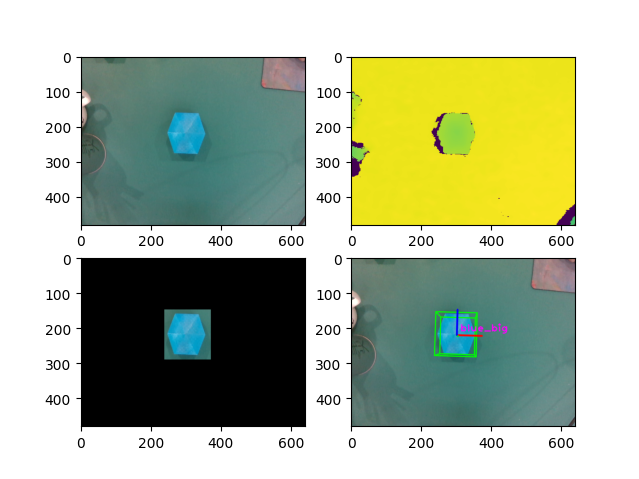

# FoundationPose 实用接口



基于 Docker 容器的任意物体六自由度位姿估计模型 [FoundationPose](https://github.com/NVlabs/FoundationPose) 部署，通过 FastAPI 从容器外部访问模型以使用 FoundationPose 模型并避免不必要的环境依赖配置。

## 项目部署

克隆项目

```shell
git clone https://github.com/tonyddg/fpinterface.git
git submodule update --init --recursive
```

拉取 FoundationPose 镜像

```shell
docker pull wenbowen123/foundationpose && docker tag wenbowen123/foundationpose foundationpose
```

进入项目根目录，运行以下命令创建 FoundationPose 容器，可根据需要挂载其他数据集、容器，其中
- `-v <模型权重文件夹>:/app/FoundationPose/weights` 需要自行下载两个[模型权重](https://drive.google.com/drive/folders/1DFezOAD0oD1BblsXVxqDsl8fj0qzB82i?usp=sharing)并填入所在目录的绝对路径
- 环境变量 `-e SERVER_CONFIG` 表明模型配置文件路径，可以使用从外部挂载的配置，从而在容器外修改模型配置
- 以下命令需要在项目根目录中运行，或将 `${PWD}` 修改为项目根目录

```bash
# 开放容器窗口显示权限
xhost +SI:localuser:root

docker run \
    --gpus all \
    --env NVIDIA_DISABLE_REQUIRE=1 \
    -it --network=host --name fpinterface \
    --cap-add=SYS_PTRACE --security-opt seccomp=unconfined \
    -v ${PWD}:/app \
    -v <模型权重文件夹>:/app/FoundationPose/weights \
    -v /tmp/.X11-unix:/tmp/.X11-unix -v /tmp:/tmp \
    --ipc=host \
    -e DISPLAY=${DISPLAY} -e GIT_INDEX_FILE \
    -e IN_CONTAINER=1 -e SERVER_CONFIG=/app/app/server_config.yaml\
    foundationpose:latest bash -c "cd /app && bash"
```

进入容器后运行以下命令完成安装

```shell
bash /app/setup_container.sh
```

启动并附加到 docker 容器上

```shell
docker start  fpinterface && docker attach  fpinterface
```

启动模型服务器

```shell
# uvicorn 默认使用 8000 端口
docker start  fpinterface && docker exec -it fpinterface bash -c "cd /app/app && uvicorn server:app"

# 选择指定的端口
docker start  fpinterface && docker exec -it fpinterface bash -c "cd /app/app && uvicorn server:app --port <服务端口>"
```

## 服务端配置

模型推理控制参数位于 `/app/app/server_config.yaml`，需要 `Ctrl + C` 关闭服务器再重启设置才能生效，配置示例如下

```yaml
# 相机内参矩阵
cam_k: [604.82214, 0.0, 319.2875, 0.0, 604.3031, 234.96078, 0.0, 0.0, 1.0]
# 位姿估计质量参数
candidate_quality: l                  # 候选位姿数（显著影响精度与推理速度）
refine_iteration: 3                   # 候选位姿迭代次数（影响精度与推理速度）
post_track: 5                         # 检测位姿迭代次数（对推理速度影响较小）
# 模型配置字典，模型名 : 模型路径（路径基于容器，见说明确定挂载关系）
mesh_cnf_dict: 
  blue_big: /example/mine/blue_big/blue_big.PLY
  green_small: /example/mine/green_small/green_small.PLY
  yellow_middle: /example/mine/yellow_middle/yellow_middle.PLY
# 深度调整参数（默认为米，确保传入模型的深度图像素单位为米）
z_far: 1.50
z_near: 0.10
```

如果希望添加自定义模型
- 可使用 Solidworks 模型染色后导出为 `.PLY`，删除其中中文注释 `comment SOLIDWORKS generated,length unit = ��`
- 在配置文件 `/app/app/server_config.yaml` 的键 `mesh_cnf_dict` 下添加 `模型名 : 模型路径` 的键值对

## 实用测试脚本

以下实用测试脚本需要在容器中运行，命令行参数通过 `-h` 查询
- `/app/app/model_render.py` 渲染给定的模型
- `/app/app/single_shot.py` 根据给定的 rbg，深度，掩膜图进行推理

## 客户端使用

客户端模块为 `fpinterface-client`
- 通过 `pip install "git+https://github.com/tonyddg/fpinterface.git@main#subdirectory=fpinterface-client"` 安装到环境中
- 使用示例可查看 `fpinterface-client/src/fpinterface_client/__main__.py`, 在安装客户端后使用 `python -m fpinterface_client` 运行示例及可视化方法
- 通过 `from fpinterface_client import FoundationPoseClient` 引入客户端类
- 客户端类通过方法 `infer` 发起推理请求获取结果，对于图像格式说明见函数注释